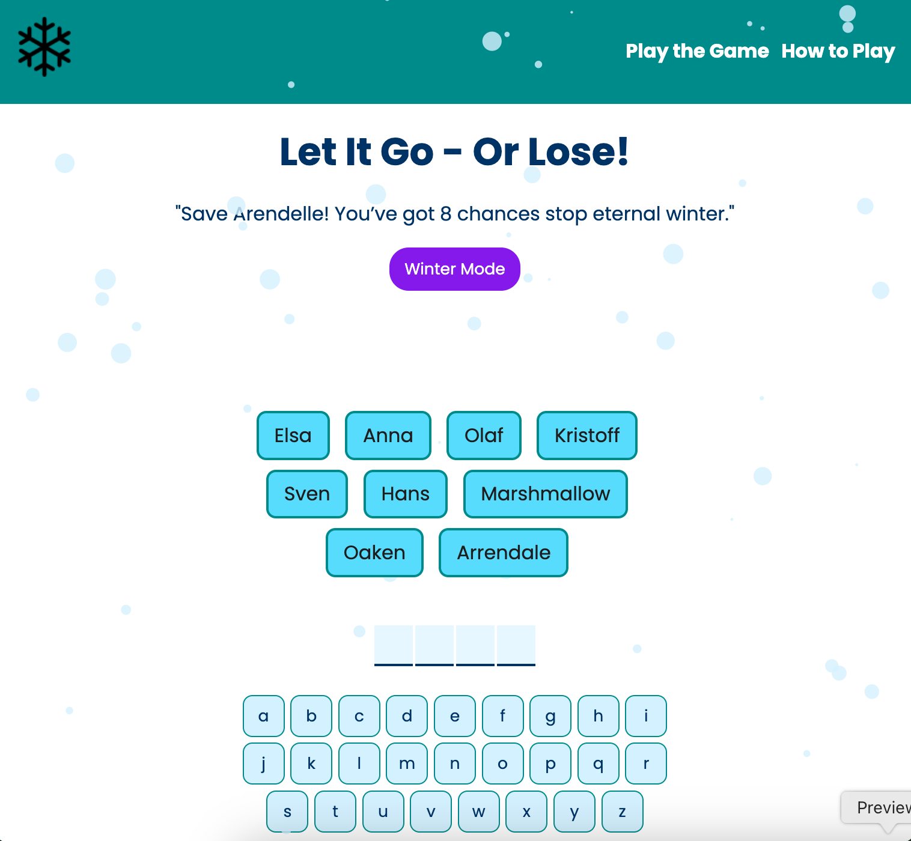

# Let It Go Or Lose - A mash up of guess the word game from the Scrimba React Course

## Table of contents

- [Overview](#overview)
  - [The challenge](#the-challenge)
  - [Screenshot](#screenshot)
  - [Links](#links)
- [My process](#my-process)
  - [Built with](#built-with)
  - [What I learned](#what-i-learned)
  - [Continued development](#continued-development)
  - [Useful resources](#useful-resources)

## Overview

This original project that this game is based on was part of the React Basics Course. I have made quite a few changes to the oroginal game to practice skills I learnt during the course and beyond. The main changes I made were adding the Frozen theme and color palette, updating the list of guessing words to include cvc words for younger players, changing the losing messages, adding dark mode, an enter page and a how to play page.

### The challenge

Users should be able to:

- Enter the game
- Toggle between ice and winter mode
- Use the keyboard to guess letters
- See wrong guessed letters turn red on the keyboard
- See the correct guesses appear

### Screenshot

### Links

- Solution URL: (https://github.com/LaurenAMolloy/let-it-go-or-lose)
- Live Site URL: (https://laurenamolloy.github.io/blog-preview-card-main/)

### Built with

- React
- Vite
- JavaScript
- Semantic HTML5 markup
- CSS custom properties
- Flexbox

### What I learned

I have learnt so many new skills and concepts during the build of this project. This was my second capstone project in React. I learnt about reusability, useContext, useEffect, useState React Router, layouts, how to use values derived from state and much more.

### Continued development

Moving forward I would like to continue learning about reusability, further my understanding of React Router and experiment more with integrating data from API's into React projects.

### Useful resources

- [tsParticles](https://particles.js.org/) - This helped me to implement the snow effect.

- [useSound Hook by Josh Comeau](https://www.joshwcomeau.com/react/announcing-use-sound-react-hook/) - This helped me bring my app alive by adding subtle sound effects.

Thanks to my tutor Sarah Soutoul for your patience and support and to Scrimba for making great learning resources.
