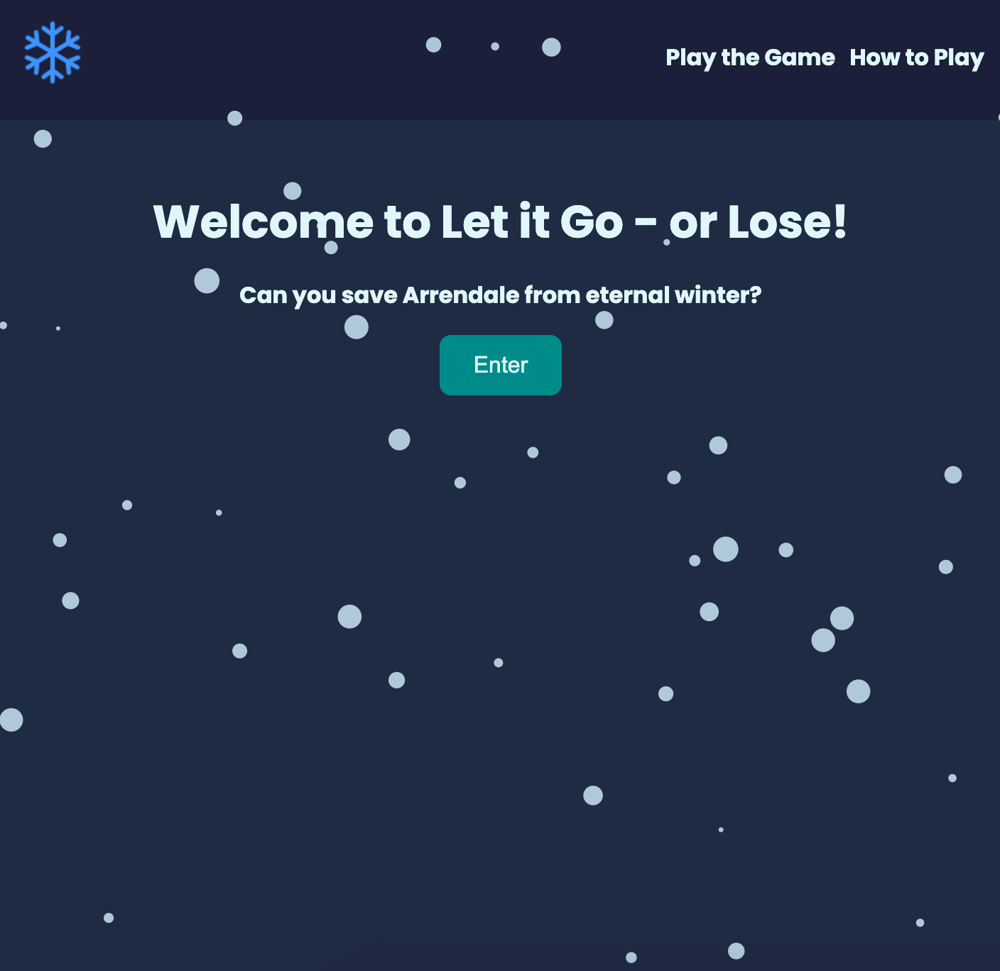
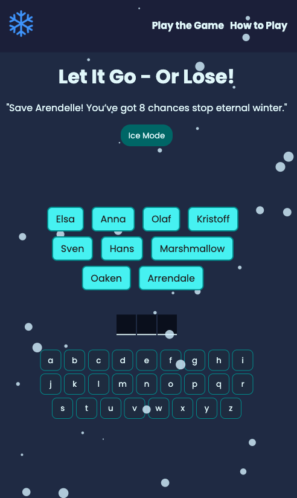
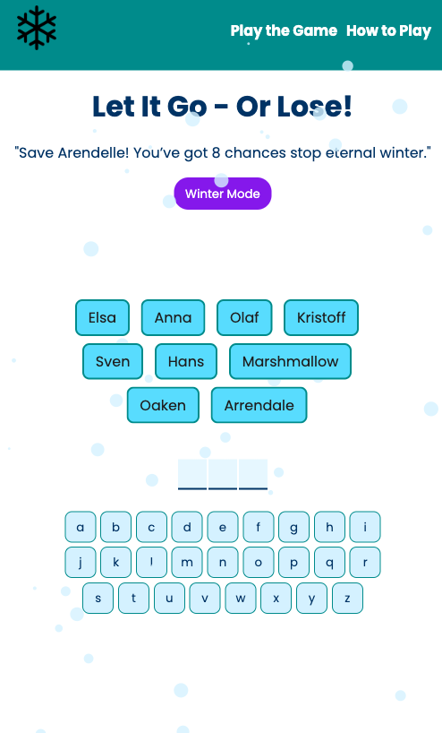

# Let It Go Or Lose - A fun "Frozen" themed game based on the classic guess the word!

## Table of contents

- [Overview](#overview)
  - [The challenge](#the-challenge)
  - [Screenshot](#screenshot)
  - [Links](#links)
- [My process](#my-process)
  - [Built with](#built-with)
  - [What I learned](#what-i-learned)
  - [Continued development](#continued-development)
  - [Useful resources](#useful-resources)

## Overview

This project is a twist on the classic, Guess the Word. I have made quite a few changes to the original game. The main changes I made were adding the Frozen theme and color palette, updating the list of guessing words to include cvc words for younger players, changing the losing messages, adding dark mode, an enter page and a how to play page.

### The challenge

Users should be able to:

- Enter the game
- Toggle between ice and winter mode
- Use the keyboard to guess letters
- See wrong guessed letters turn red on the keyboard
- See the correct guesses appear

### Screenshot

### Links

- Solution URL: (https://github.com/LaurenAMolloy/let-it-go-or-lose)
- Live Site URL: (https://let-it-go-or-lose.onrender.com/)

### Built with

- React
- Vite
- JavaScript
- Semantic HTML5 markup
- CSS custom properties
- Flexbox

### Skills 

I have practiced so many skills and concepts during the build of this project. I utilised React Hooks and concepts such as reusability, useContext, useEffect, useState React Router, layouts, how to use values derived from state and much more.

### Continued development

Moving forward I would like to continue learning about reusability, further my understanding of React Router and create more MPA's.

### Useful resources

- [tsParticles](https://particles.js.org/) - This helped me to implement the snow effect.

- [useSound Hook by Josh Comeau](https://www.joshwcomeau.com/react/announcing-use-sound-react-hook/) - This helped me bring my app alive by adding subtle sound effects.
