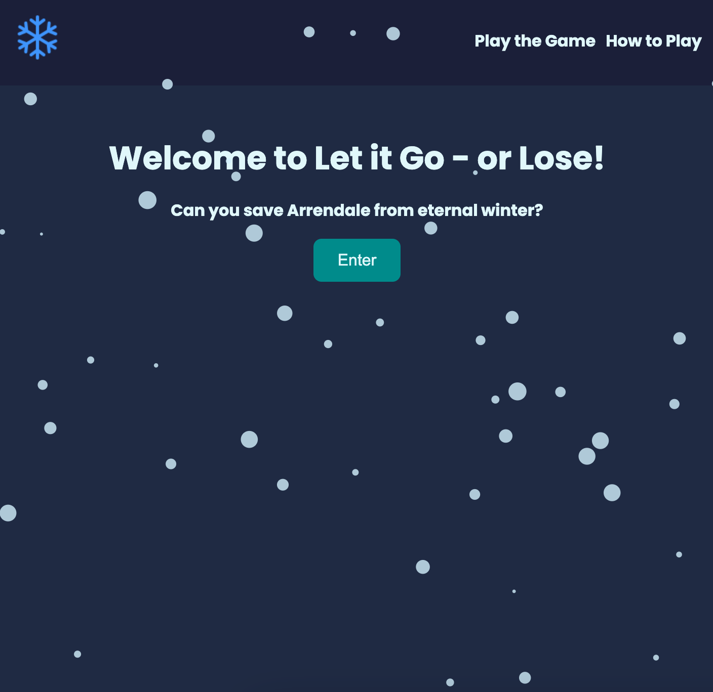
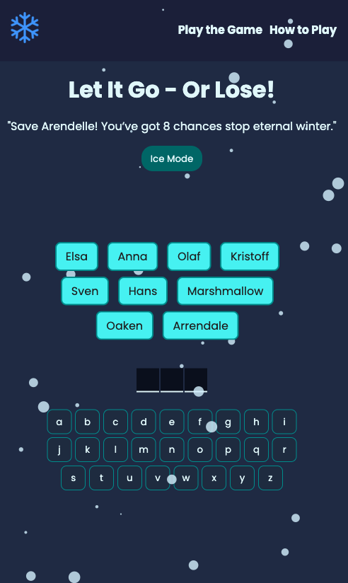
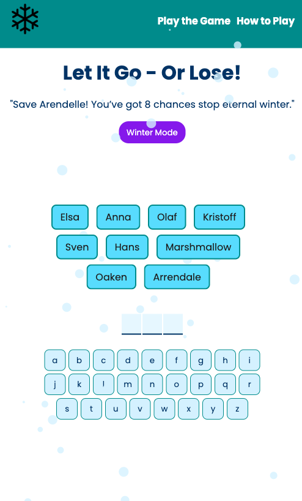

# 🎮 Let It Go or Lose 
## A gamified early literacy experience using CVC word recognition

## Table of contents

- [Overview](#overview)
  - [Learning Objective](#learning-objective)
  - [Game Design Features](#game-design-features)
  - [Design Approach](#design-approach)
  - [Screenshot](#screenshot)
  - [Links](#links)
  - [Built with](#built-with)
  - [Useful resources](#useful-resources)

## Overview

Let It Go or Lose is an interactive, game-based learning experience designed to support early readers in practicing CVC (consonant-vowel-consonant) word recognition.

Inspired by the classic “guess the word” format, this project reimagines the experience as a play-based learning tool, combining simple game mechanics, visual feedback, and repetition to reinforce foundational literacy skills.

The game incorporates a themed, engaging interface and age-appropriate word selection to support independent learning and sustained engagement.

## Learning Objective

- Reinforce recognition and recall of CVC words
- Support early phonics development through repetition and interaction
- Encourage active participation and self-correction

## Game Design Features

- Interactive letter selection using keyboard input

Immediate visual feedback:

- Correct guesses revealed in context
- Incorrect guesses highlighted in red
- Themed modes (“Ice” and “Winter”) to increase engagement

Structured progression through word challenges

“How to Play” onboarding screen for accessibility

Light/dark mode for usability

## Design Approach

This project was designed using principles of:

Gamification (challenge, feedback, replayability)

User-centered design for young learners

Scaffolded learning, with controlled vocabulary (CVC words)

Clear feedback loops to support independent progress

The goal was to create an experience that balances fun and learning, where interaction directly reinforces understanding.

### Screenshot

### Links

- Solution URL: (https://github.com/LaurenAMolloy/let-it-go-or-lose)
- Live Site URL: (https://let-it-go-or-lose.onrender.com/)

### Built with

- React
- Vite
- JavaScript
- Semantic HTML5 markup
- CSS custom properties
- Flexbox

### Useful resources

- [tsParticles](https://particles.js.org/) - This helped me to implement the snow effect.

- [useSound Hook by Josh Comeau](https://www.joshwcomeau.com/react/announcing-use-sound-react-hook/) - This helped me bring my app alive by adding subtle sound effects.
